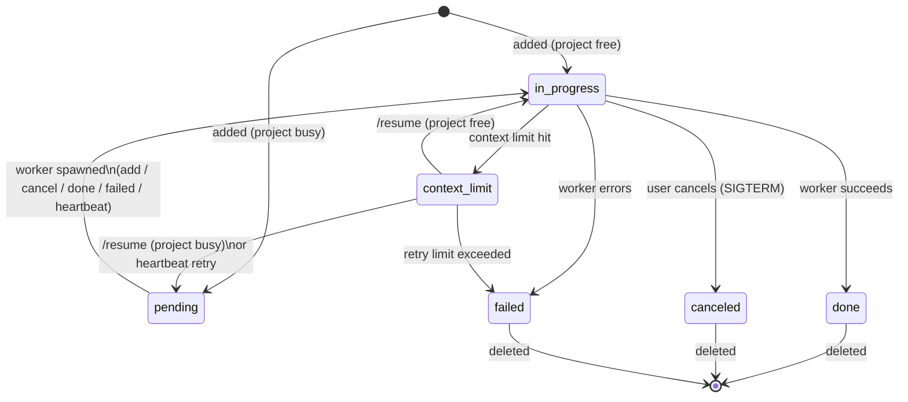

# todo-board

A lightweight task queue and web UI for managing AI agent work items. Tasks are dispatched to
worker subprocesses (Claude CLI) and their status tracked in real time.

## Features

- Dark-themed web UI with live polling (no page reload needed)
- Tasks grouped by project, with status badges: `pending`, `in_progress`, `done`, `blocked`, `failed`, `canceled`, `context_limit`
- Auto-spawns one Claude worker per project (enforced: no concurrent workers on the same project)
- **Session reuse per project** — each project maintains a Claude session; subsequent todos resume where the last one left off, cutting context overhead significantly
- **Stale session fallback** — if a session has expired, automatically retries with a fresh cold start
- **Task chaining** — tasks generated by "Break down" are linked via `prev_task_id`; each task receives the previous task's result as context, so work builds naturally on what came before
- **Model tiering** — configurable model per project (or per todo); defaults to `CLAUDE_MODEL` env var
- **Runaway protection** — configurable max turns and optional budget cap per worker run
- Stalled workers detected after 25 min and re-queued automatically
- **Retry cap** — context_limit todos are retried up to `TODO_MAX_RETRIES` times, then marked failed
- Cancel running workers (sends SIGTERM + git reset on work dir)
- Lock/unlock todos to prevent accidental dispatch
- Inline editing of todo text (while not in progress)
- Editable global requirements shown to every worker
- Live progress line updated from worker `STATUS:` output
- Token usage and duration tracked per todo (incl. cache hit %) accumulated into lifetime stats
- **Task breakdown** — paste a high-level goal, click "Break down ↓" to get Claude to decompose it into subtasks; review and approve before queuing; chain badge (`⛓ N/M`) shown on linked tasks
- Auto-reloads the UI when server or template files change on disk

## Requirements

- Python 3.11+
- `claude` CLI in PATH (or set `CLAUDE_BIN`)

```bash
pip install -e .
# or without installing:
pip install fastapi uvicorn
```

## Running

```bash
# Recommended (module entry point)
python -m todo_board

# Or via uvicorn directly
python -m uvicorn todo_board.server:app --host 0.0.0.0 --port 7842

# Or via the installed script
todo-board
```

Open [http://localhost:7842](http://localhost:7842).

After making code changes, restart the server (uvicorn runs without `--reload`):

```bash
bash restart.sh
```

`restart.sh` finds the process listening on port 7842, terminates it, and starts a fresh server.

## Heartbeat / stall detection

Run periodically (e.g. via cron) to detect stalled workers and re-queue interrupted todos:

```bash
python -m todo_board.heartbeat
# or via the installed script:
todo-board-heartbeat
```

The heartbeat:
1. Marks `in_progress` todos as `context_limit` if stalled >25 min
2. Resets `context_limit` todos to `pending` for retry
3. Spawns workers for any `pending` todos that have no active worker on their project

## Environment variables

| Variable | Default | Description |
|---|---|---|
| `TODO_BOARD_PORT` | `7842` | Port for the web server |
| `TODO_BOARD_URL` | `http://localhost:7842` | Base URL used by workers to call back |
| `TODO_BOARD_DATA_DIR` | parent of package dir | Directory for `todos.json`, `projects.json`, etc. |
| `TODO_BOARD_PROJECTS_DIR` | parent of `DATA_DIR` | Directory scanned for project subdirectories |
| `CLAUDE_BIN` | `claude` (auto-detected) | Path to the Claude CLI binary |
| `CLAUDE_MODEL` | `sonnet` | Default Claude model; overridden per project or per todo |
| `CLAUDE_MAX_TURNS` | `30` | Max conversation turns per worker run |
| `CLAUDE_MAX_BUDGET_USD` | _(none)_ | Optional spend cap per worker run (e.g. `0.50`) |
| `TODO_MAX_RETRIES` | `2` | Max times a context_limit todo is retried before marking failed |
| `MEMORY_FILE` | _(none)_ | Optional path to a markdown file injected as context into each worker prompt |
| `CLAUDE_WORK_DIR` | `$HOME` | Working directory for Claude worker subprocesses |

## Project layout

```
todo_board/
    __init__.py
    __main__.py     # entry point: python -m todo_board
    config.py       # paths, constants, and default rules
    storage.py      # JSON load/save for todos, projects, rules, stats, statusline
    spawner.py      # shared worker spawning logic
    server.py       # FastAPI app and all API routes
    worker.py       # subprocess worker (spawned per todo)
    breakdown.py    # task decomposition via Claude reverse prompting
    heartbeat.py    # stall detection and re-queue
    templates/
        index.html  # single-page UI (dark theme, self-contained)
restart.sh          # kill port 7842 listener, start fresh uvicorn
tests/
    conftest.py
    test_clear.py
    test_edit.py
    test_breakdown.py
    test_resume.py
    test_retry.py
    test_stats.py
    test_worker_limit_detection.py
```

## API

| Method | Path | Description |
|---|---|---|
| `GET` | `/api/todos` | List all todos |
| `POST` | `/api/add` | Add a todo `{text, project_id?, model?, prev_task_id?}` |
| `POST` | `/api/breakdown` | Decompose a task `{text, project_id?}` → `{tasks: [...]}` |
| `POST` | `/api/status/:id` | Set status `{status, duration_secs?, tokens?, result?}` |
| `POST` | `/api/progress/:id` | Set live progress text `{text}` (max 150 chars) |
| `POST` | `/api/done/:id` | Mark done |
| `POST` | `/api/delete/:id` | Delete todo (blocked if `in_progress`) |
| `POST` | `/api/delete-done` | Delete all done/canceled todos (accumulates stats) |
| `POST` | `/api/cancel/:id` | Cancel worker (SIGTERM + git reset on work dir) |
| `POST` | `/api/resume/:id` | Re-spawn worker for a `context_limit` todo (queued as `pending` if project already has an active worker) |
| `POST` | `/api/lock/:id` | Lock or unlock a todo `{locked: bool}` |
| `POST` | `/api/edit/:id` | Edit todo text `{text}` (blocked if `in_progress`) |
| `POST` | `/api/note/:id` | Set note `{note}` |
| `GET/POST` | `/api/statusline` | Read / write status line text |
| `GET/POST` | `/api/requirements` | Read / write global requirements |
| `GET` | `/api/projects` | List projects |
| `POST` | `/api/projects/add` | Add project `{name}` |
| `POST` | `/api/projects/delete/:id` | Delete project (unlinks todos) |
| `GET` | `/api/stats` | Lifetime token usage and duration totals |
| `GET` | `/api/state` | Returns `{mtime}` of todos file — used by UI for change detection |
| `GET` | `/api/version` | Returns max mtime of server + template — used for auto-reload |

## Task state graph



`blocked` is a manual hold state (set via `/api/status`) with no automatic transitions — it pauses dispatch without deleting the todo.

## Worker lifecycle

When a new todo is added (and no worker is active for its project), `todo_board/worker.py` is
spawned as a subprocess. It:

1. Sets status → `in_progress`
2. If a prior session exists for the project, resumes it with `--resume <session_id>` (falls back to cold start if session is expired or invalid)
3. Cold start: calls `claude -p <task> --append-system-prompt <rules+memory> --output-format stream-json`
4. If the todo has a `prev_task_id`, the previous task's stored `result` is injected into the prompt as context
5. Parses streaming JSON output, forwarding `STATUS:` lines as live progress updates
6. Saves the returned `session_id` for the next todo in the same project
7. On completion: sets status → `done` (with `result` up to 3000 chars) or `failed`, records token usage (incl. cache breakdown) and duration
8. Clears the status line and removes its PID file

When a worker finishes (`done`, `failed`, or `canceled`), the server automatically picks up the
next `pending` todo in the same project and spawns a new worker for it.

A todo that hits `context_limit` is retried automatically (up to `TODO_MAX_RETRIES` times).
Resuming a `context_limit` todo when another worker is already active in the same project will
queue it as `pending` instead of spawning immediately.
After exceeding the retry limit, it is marked `failed` with a note explaining the retry limit was exceeded.

## Testing

```bash
pip install -e ".[test]"
pytest tests/ -v
```

## License

MIT
