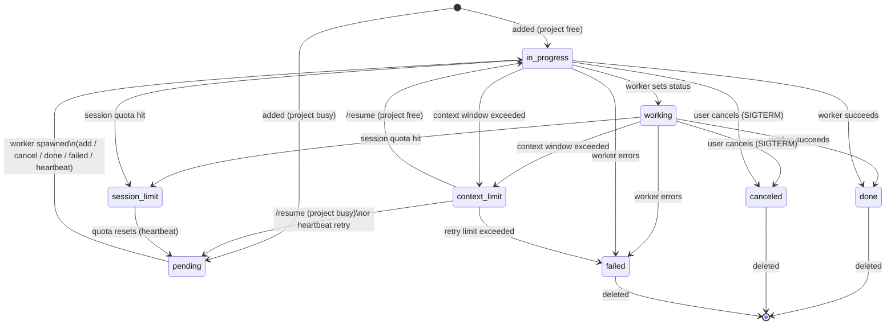

# todo-board

A lightweight task queue and web UI for managing AI agent work items. Tasks are dispatched to
worker subprocesses (Claude CLI) and their status tracked in real time.

## Features

- Dark-themed web UI with live polling (no page reload needed)
- Tasks grouped by project, with status badges: `pending`, `in_progress`, `working`, `done`, `blocked`, `failed`, `canceled`, `context_limit`, `session_limit`
- Auto-spawns one Claude worker per project (enforced: no concurrent workers on the same project)
- **Session reuse per project** — each project maintains a Claude session; subsequent todos resume where the last one left off, cutting context overhead significantly
- **Stale session fallback** — if a session has expired, automatically retries with a fresh cold start
- **Task chaining** — link tasks via `prev_task_id`; each task receives the previous task's result as context
- **Sub-tasks** — tasks can have a `parent_id`; parent auto-completes when all sub-tasks finish
- **Model tiering** — configurable model per project (or per todo); defaults to `CLAUDE_MODEL` env var
- **Runaway protection** — configurable max turns and optional budget cap per worker run
- **Stalled worker detection** — workers stalled >25 min are re-queued automatically
- **Retry cap** — `context_limit` todos are retried up to `TODO_MAX_RETRIES` times, then marked failed
- **Session limit handling** — if Claude's session quota is hit, the todo is parked as `session_limit` and auto-resumed when the quota resets
- **Clarification flow** — workers can emit `QUESTION:` / `WAITING_FOR_ANSWERS` blocks to pause and ask for input before continuing
- **File delivery** — workers can emit `FILE:/absolute/path` lines; files are copied to the results store and shown as download links in the News Feed
- **News Feed tab** — task completions, errors, and warnings stream into a feed with read/unread tracking and file download links
- **GitHub release poller** — monitors configured GitHub repos for new releases and posts them to the News Feed
- **Crypto Forecast tab** — BTC price chart, sentiment signals, and news headlines via integrated btc-outlook
- **Plugin integration** — external scripts can be registered as plugins and triggered via the API
- Cancel running workers (sends SIGTERM to the process group)
- Lock/unlock todos to prevent accidental dispatch
- Inline editing of todo text (while not in progress)
- Drag-and-drop task reordering
- Editable global requirements shown to every worker
- Live progress line updated from worker `STATUS:` output
- Token usage and duration tracked per todo (incl. cache hit %) accumulated into lifetime stats
- Auto-reloads the UI when server or template files change on disk
- Robust startup recovery — all `in_progress`/`working` tasks are unconditionally reset to `pending` on server start (PID-based checks are unreliable after host reboots)

## Requirements

- Python 3.11+
- `claude` CLI in PATH (or set `CLAUDE_BIN`)

```bash
pip install -e .
# or without installing:
pip install fastapi uvicorn
```

## Running

```bash
# Recommended (module entry point)
python -m todo_board

# Or via uvicorn directly
python -m uvicorn todo_board.server:app --host 0.0.0.0 --port 7842

# Or via the installed script
todo-board
```

Open [http://localhost:7842](http://localhost:7842).

After making code changes, restart the server (uvicorn runs without `--reload`):

```bash
bash restart.sh
```

`restart.sh` finds the process listening on port 7842, terminates it, and starts a fresh server.

## Heartbeat / stall detection

Run periodically (e.g. via cron) to detect stalled workers and re-queue interrupted todos:

```bash
python -m todo_board.heartbeat
# or via the installed script:
todo-board-heartbeat
```

The heartbeat:
1. Marks `in_progress` todos as `context_limit` if stalled >25 min
2. Resets `context_limit` todos to `pending` for retry
3. Re-queues `session_limit` todos whose reset time has passed
4. Spawns workers for any `pending` todos that have no active worker on their project

## Worker output conventions

Workers (and the tasks they run) communicate with the server via stdout markers:

| Marker | Effect |
|---|---|
| `STATUS: <text>` | Updates the live progress line for the task |
| `FILE:/absolute/path` | Copies the file to the results store; download link appears in News Feed |
| `QUESTION: <q>` / `OPTION: <o>` / `WAITING_FOR_ANSWERS` | Pauses the task and asks for user input |
| `FAILED:<reason>` | Marks the task as failed with the given reason |

## Environment variables

| Variable | Default | Description |
|---|---|---|
| `TODO_BOARD_PORT` | `7842` | Port for the web server |
| `TODO_BOARD_URL` | `http://localhost:7842` | Base URL used by workers to call back |
| `TODO_BOARD_DATA_DIR` | parent of package dir | Directory for `todos.json`, `projects.json`, etc. |
| `TODO_BOARD_PROJECTS_DIR` | parent of `DATA_DIR` | Directory scanned for project subdirectories |
| `CLAUDE_BIN` | `claude` (auto-detected) | Path to the Claude CLI binary |
| `CLAUDE_MODEL` | `sonnet` | Default Claude model; overridden per project or per todo |
| `CLAUDE_MAX_TURNS` | `30` | Max conversation turns per worker run |
| `CLAUDE_MAX_BUDGET_USD` | _(none)_ | Optional spend cap per worker run (e.g. `0.50`) |
| `TODO_MAX_RETRIES` | `2` | Max times a `context_limit` todo is retried before marking failed |
| `MEMORY_FILE` | _(none)_ | Optional path to a markdown file injected as context into each worker prompt |
| `CLAUDE_WORK_DIR` | `$HOME` | Working directory for Claude worker subprocesses |

## Project layout

```
todo_board/
    __init__.py
    __main__.py        # entry point: python -m todo_board
    config.py          # paths, constants, and default rules
    storage.py         # JSON load/save for todos, projects, news, stats, etc.
    spawner.py         # shared worker spawning logic
    server.py          # FastAPI app and all API routes
    worker.py          # subprocess worker (spawned per todo)
    heartbeat.py       # stall detection and re-queue
    github_poller.py   # GitHub release polling
    plugin_runner.py   # plugin execution layer
    templates/
        index.html     # single-page UI (dark theme, self-contained)
restart.sh             # kill port 7842 listener, start fresh uvicorn
tests/
    conftest.py
    test_add.py
    test_cancel.py
    test_clear.py
    test_coverage_gaps.py
    test_crypto.py
    test_edit.py
    test_github_and_plugins.py
    test_heartbeat.py
    test_lock.py
    test_misc_endpoints.py
    test_new_coverage.py
    test_projects.py
    test_questions.py
    test_reorder.py
    test_resume.py
    test_retry.py
    test_shutdown_recovery.py
    test_startup_recovery.py
    test_stats.py
    test_status.py
    test_worker_io.py
    test_worker_limit_detection.py
    test_worker_prompts.py
    test_worker_unit.py
```

## API

| Method | Path | Description |
|---|---|---|
| `GET` | `/api/todos` | List all todos |
| `POST` | `/api/add` | Add a todo `{text, project_id?, model?, prev_task_id?, parent_id?, subtask_idx?}` |
| `POST` | `/api/status/:id` | Set status `{status, duration_secs?, tokens?, result?, result_files?}` |
| `POST` | `/api/progress/:id` | Set live progress text `{text}` (max 150 chars) |
| `POST` | `/api/done/:id` | Mark done |
| `POST` | `/api/delete/:id` | Delete todo (blocked if `in_progress`) |
| `POST` | `/api/delete-done` | Delete all done/canceled todos (accumulates stats) |
| `POST` | `/api/cancel/:id` | Cancel worker (SIGTERM to process group) |
| `POST` | `/api/resume/:id` | Re-spawn worker for a `context_limit` todo |
| `POST` | `/api/lock/:id` | Lock or unlock a todo `{locked: bool}` |
| `POST` | `/api/edit/:id` | Edit todo text `{text}` (blocked if `in_progress`) |
| `POST` | `/api/note/:id` | Set note `{note}` |
| `POST` | `/api/reorder` | Reorder todos `{ids: [...]}` |
| `POST` | `/api/questions/:id` | Set clarification questions `{questions: [...]}` |
| `POST` | `/api/questions/:id/answer` | Submit answer to a question |
| `GET/POST` | `/api/statusline` | Read / write status line text |
| `GET/POST` | `/api/requirements` | Read / write global requirements |
| `GET` | `/api/projects` | List projects |
| `POST` | `/api/projects/add` | Add project `{name}` |
| `POST` | `/api/projects/delete/:id` | Delete project (unlinks todos) |
| `GET` | `/api/stats` | Lifetime token usage and duration totals |
| `GET` | `/api/state` | Returns `{mtime}` of todos file — used by UI for change detection |
| `GET` | `/api/version` | Returns max mtime of server + template — used for auto-reload |
| `GET` | `/api/news` | List news feed entries |
| `POST` | `/api/news` | Create a news entry `{type, message, todo_id?, project_id?, files?}` |
| `POST` | `/api/news/mark-read` | Mark entries read `{ids?}` (omit `ids` to mark all) |
| `POST` | `/api/news/clear` | Delete all news entries |
| `GET` | `/api/results/:todo_id/:filename` | Download a file produced by a task |
| `GET/POST` | `/api/github-links` | Read / write monitored GitHub repo slugs |
| `POST` | `/api/poll-releases` | Trigger an immediate GitHub release poll |
| `GET` | `/api/plugins` | List registered plugins and their run state |
| `POST` | `/api/plugins/:name/run` | Trigger a plugin |
| `GET` | `/api/crypto/data` | Current crypto forecast data |
| `POST` | `/api/crypto/refresh` | Force-refresh crypto data |
| `GET` | `/api/crypto/chart` | BTC price chart image (PNG) |

## Task state graph



`blocked` is a manual hold state (set via `/api/status`) with no automatic transitions — it pauses dispatch without deleting the todo.

`planned` is used for parent tasks that are waiting for their sub-tasks to complete.

## Worker lifecycle

When a new todo is added (and no worker is active for its project), `todo_board/worker.py` is
spawned as a subprocess. It:

1. Sets status → `in_progress`, then → `working` once the Claude process starts
2. If a prior session exists for the project, resumes it with `--resume <session_id>` (falls back to cold start if session is expired or invalid)
3. Cold start: calls `claude -p <task> --append-system-prompt <rules+memory> --output-format stream-json`
4. If the todo has a `prev_task_id`, the previous task's stored `result` is injected into the prompt as context
5. If the todo has pending answered questions, they are injected as clarifications
6. Parses streaming JSON output, forwarding `STATUS:` lines as live progress updates
7. Collects any `FILE:` lines and copies the referenced files to `results/<todo_id>/`
8. Saves the returned `session_id` for the next todo in the same project
9. On completion: sets status → `done` (with `result` up to 3000 chars and optional `result_files`) or `failed`, records token usage (incl. cache breakdown) and duration
10. Posts a News Feed entry with a result snippet and any file download links
11. Clears the status line and removes its PID file

When a worker finishes (`done`, `failed`, or `canceled`), the server automatically picks up the
next `pending` todo in the same project and spawns a new worker for it.

## Startup recovery

On startup, all tasks in `in_progress` or `working` state are unconditionally reset to `pending`
and their PID files removed. This guarantees clean recovery after a SIGKILL, host reboot, or any
other unclean shutdown — no stale tasks ever get permanently stuck.

## Testing

```bash
pip install -e ".[test]"
pytest tests/ -v
```

## License

MIT
